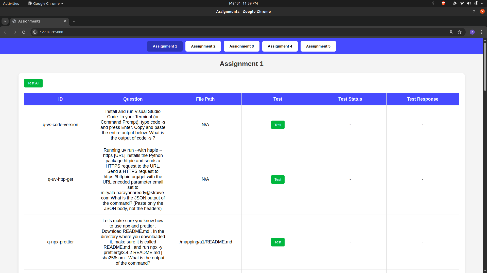
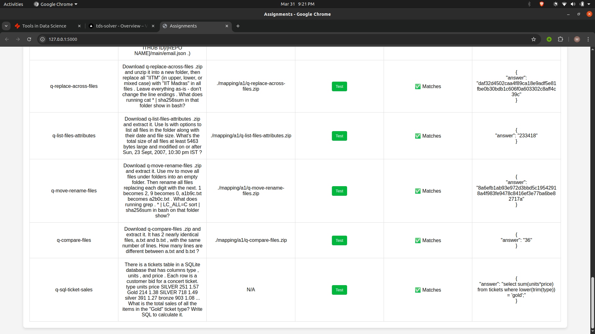
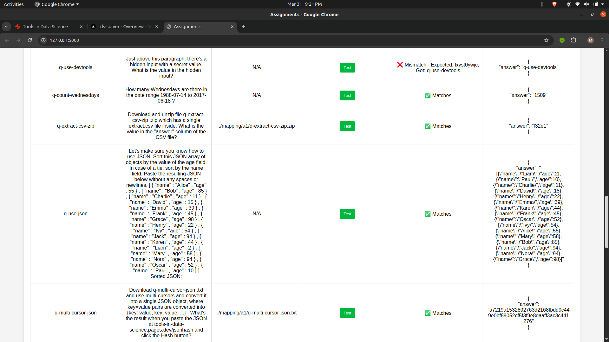
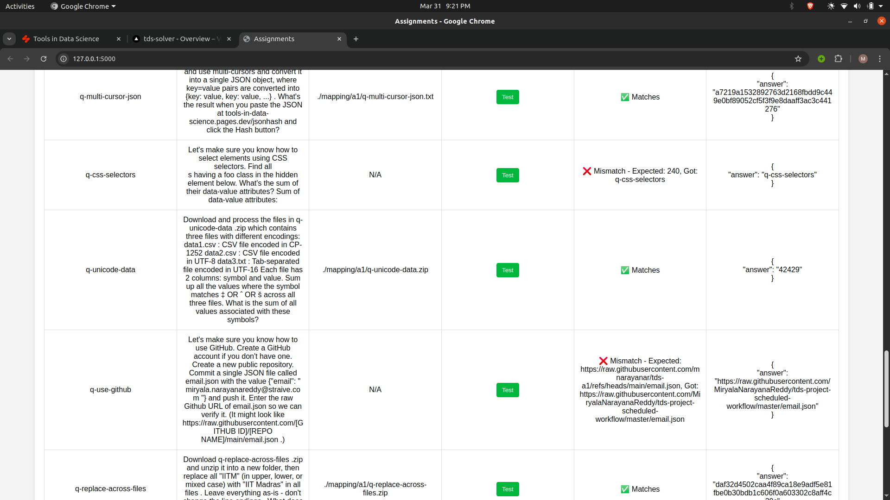

# tds Evaluator 

This is a simple evaluator for the tds course. 
This has all questions and answers from A1 to A5.
You can test your API in project 2 for each assignment. 

in code change the url to your API and run the code. 

## Related Projects

- [tds-question-extractor](https://github.com/MiryalaNarayanaReddy/tds-question-extractor)
- [tds-evaluator](https://github.com/MiryalaNarayanaReddy/tds_evaluator)

# images

